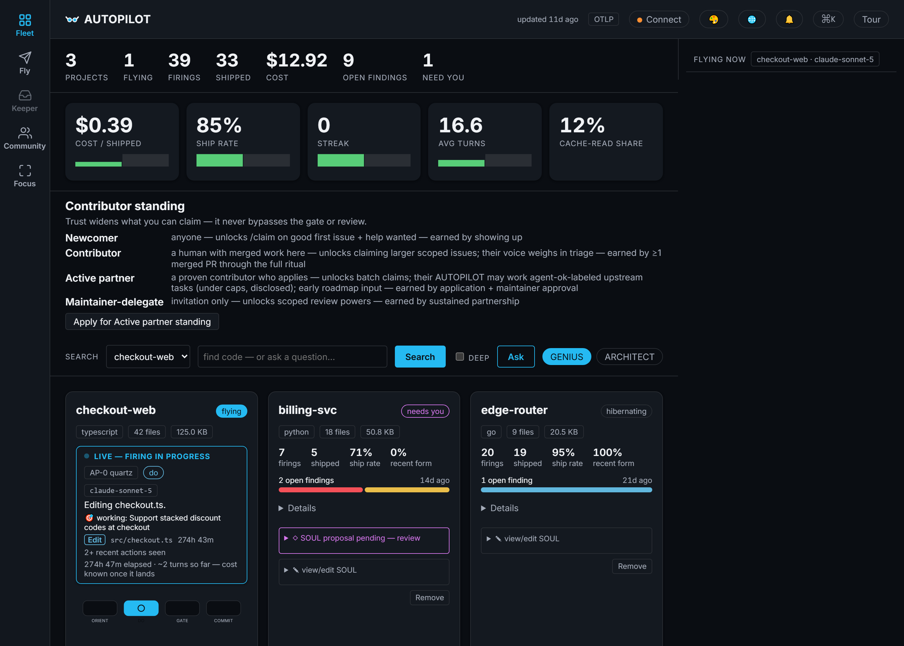
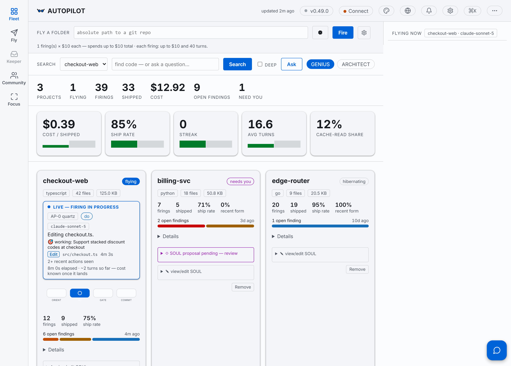
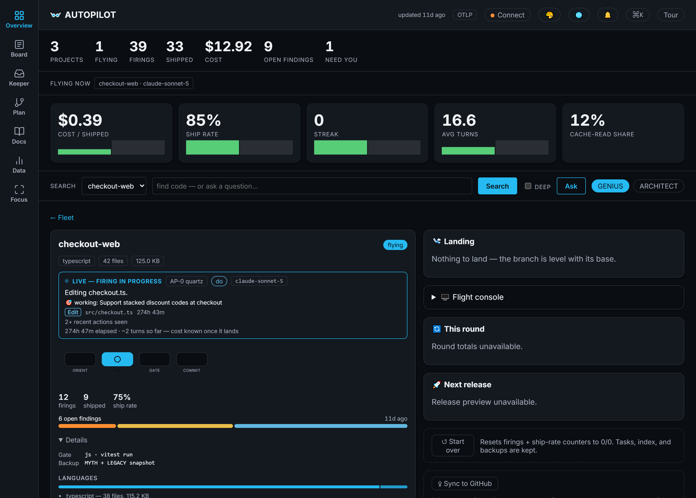

<p align="center">
  <picture>
    <source media="(prefers-color-scheme: dark)" srcset="docs/brand/goggles-mark-dark.svg">
    
  </picture>
</p>

# AUTOPILOT

<p align="center">
  <a href="https://github.com/M-A-S-T-E-R-M-I-N-D/AUTOPILOT/actions/workflows/ci.yml"></a>
  <a href="https://github.com/M-A-S-T-E-R-M-I-N-D/AUTOPILOT/releases"></a>
  
  <a href="LICENSE"></a>
  =22.23">
  
  
  <a href="https://github.com/M-A-S-T-E-R-M-I-N-D/AUTOPILOT/discussions"></a>
</p>

**Point your Claude account at any repo — AUTOPILOT locks onto it, backs it up, understands it, and flies it on
autopilot**: shipping gated, verified work; measuring itself; surviving quota limits; and surfacing the human-only calls
for your approval.

A standalone, open-source, cross-platform autonomous engineering agent. It locks onto a project folder, researches and
understands it, stands up its own control panel, then flies the repo — improving it, finding bugs, closing security
holes, documenting, charting, detecting anomalies, and managing versions. A local web dashboard drives it all.
Multi-project. Optional local (Ollama) models. One-command install from zero.

Author / brand: **1337 · REL AZEUS · MΔSTERMIND** · License: **Apache-2.0** · No private data — ever. Built on the
shoulders of 487 open-source projects — see [`THANKS.md`](THANKS.md) and
[`docs/THIRD-PARTY-LICENSES.md`](docs/THIRD-PARTY-LICENSES.md): licenses honored, credit given, gratitude real.

> ## ⚠️ PUBLIC ALPHA — read before you fly
>
> AUTOPILOT is public **before 1.0** (all `0.x` releases are alpha), deliberately. The reasons, so expectations are
> honest:
>
> - **Public early, on purpose** — to open shared, real-world testing while the system is still forming, and because
>   an open repo is how this project's own CI, review rituals, and contributor pool are meant to run.
> - **Expect alpha behavior** — APIs, the dashboard, the store schema, and flight rituals may change without
>   migration paths between `0.x` versions. An autonomous agent that edits repos is powerful: run it against code
>   you have backups of (AUTOPILOT snapshots and gates its own work, but alpha means alpha).
> - **No misuse** — Apache-2.0 governs the license; beyond it, this project's tooling must not be used to generate
>   spam contributions, harvest data, attack repos or accounts, or automate abuse of any platform. See
>   [`SECURITY.md`](.github/SECURITY.md) for reporting and [`GOVERNANCE.md`](.github/GOVERNANCE.md) for how calls
>   get made.
> - **Identified contributors only** — every commit requires a DCO `Signed-off-by` (enforced by commitlint in CI),
>   PRs merge only through the gated review ritual (KEEPER + CODEOWNERS = @M-A-S-T-E-R-M-I-N-D), and dependency/security-
>   sensitive changes always queue for a human. Anonymous drive-by pushes are not how updates land here — that bar
>   exists so users can trust what an autonomous agent ships to them.
>
> - **Use at your own risk — and we mean it kindly**: we do not advise anyone to run an autonomous agent on
>   anything they cannot afford to lose. AUTOPILOT is provided **AS IS** (Apache-2.0 §7); whoever flies it does so
>   at their own risk and judgment. We do our best — gates, backups, containment, honest telemetry — to keep our
>   corner of the net safe, and we expect the same care from everyone who flies.
>
> **1.0.0 ships at the public-launch milestone (M9 doctrine — [`docs/RELEASING.md`](docs/RELEASING.md)); until then,
> every release is an alpha of a system that flies itself — treat it with a pilot's respect.**

## Start here (2 minutes, from nothing to a live dashboard)

```bash
git clone https://github.com/M-A-S-T-E-R-M-I-N-D/AUTOPILOT.git
cd AUTOPILOT
```

1. **Set up** — Windows: double-click `SETUP.cmd` · macOS / Linux: `./SETUP.sh` · already have Node ≥ 22.13:
   `npm install -g pnpm && pnpm run setup`. It prints a doctor report; anything not `[OK]` prints its own fix.
2. **Log in once** with `claude` (your Claude subscription — no API key, no per-token bill; see
   [Connecting your Claude account](#connecting-your-claude-account-for-live-flights)).
3. **Open the control panel:**
   ```bash
   pnpm dashboard:start    # → http://127.0.0.1:4317 (localhost-only, hardened)
   ```
4. **Fly your first mission** — the built-in calculator sample ships with 12 deliberately-red acceptance tests and
   a written mission ([`samples/calculator/MISSION.md`](samples/calculator/MISSION.md)). In the dashboard's Fly
   bar, point the folder at `samples/calculator`, click **Fly it**, and watch the agent take it 0 → 12/12 green —
   the same arc documented honestly (including what went wrong) in
   [`docs/CASE-STUDIES/calculator.md`](docs/CASE-STUDIES/calculator.md). Prefer not to spend anything yet?
   `scripts/launchers/FLY-DASHBOARD.cmd` runs a scripted **$0 demo flight** — real engine loop, gate, telemetry, no
   model calls.

**Where the docs live:** the rest of this README explains what AUTOPILOT does and why;
[`docs/README.md`](docs/README.md) is the full documentation index for everything past the basics.

## How it works (60 seconds)

AUTOPILOT's unit of work is a **firing** — one gated attempt at one task:

```
   board (tasks)          the firing               the gate                 the record
  ┌─────────────┐   ┌──────────────────┐   ┌─────────────────────┐   ┌──────────────────┐
  │ human-added │ → │ orient · pick ONE │ → │ typecheck·lint·test │ → │ commit (gate ✓)  │
  │ self-mined  │   │ task · implement  │   │ ·build — all green? │   │ or REVERT (gate ✗)│
  └─────────────┘   └──────────────────┘   └─────────────────────┘   └──────────────────┘
                                                                              ↓
                                              every firing → SQLite telemetry (cost, tokens,
                                              gate verdict, SHA-on-HEAD — mechanically verified)
```

- **Nothing lands unverified.** A firing that fails the gate reverts — bad work never reaches your history.
- **Fleets parallelize it.** N lanes fly in isolated git worktrees; a self-healing merge ladder (union merge +
  rerere + audit) collects them with zero overwrites.
- **The telemetry can't flatter itself.** Load-bearing numbers (gate result, commit-on-HEAD) are mechanically
  verified, not self-reported — and published in [the living self-study](docs/SELF-STUDY/PAPER.md).
- **Humans keep the human calls.** Dependency changes, publicity, spending — anything out-of-scope queues for
  your approval in the dashboard's KEEPER panel.

## Status

Built milestone-by-milestone per [`docs/ACTION-PLAN.md`](docs/ACTION-PLAN.md) (M0→M9). Current version **0.22.0** — see
[`CHANGELOG.md`](CHANGELOG.md).

| Milestone | What | State |
|-----------|------|-------|
| **M0** | Foundations & standards (monorepo · strict TS · CI gates · SQLite schema) | ✅ `v0.6.0` |
| **M1** | Engine — the gated autonomous loop (resilience · un-fakeable telemetry · gate+revert) | ✅ `v0.7.1` |
| **M2** | Onboarding — lock · back up (MYTH/LEGACY) · detect the gate · content-hash index | ✅ `v0.8.0` |
| **M3** | Read-only dashboard ("watch it fly") | ✅ `v0.10.0` |
| **M4** | Reactivity — live flight control, RAG, task board, parallel fleets | 🔄 in progress |
| M5–M9 | Control & approvals · efficiency · multi-project · harness · packaging | planned |

The proof is in this repository itself: AUTOPILOT **builds AUTOPILOT** — fleets of its own agents fly this repo, and
every firing, gate verdict, ship, death, and dollar is measured and published in
[`docs/SELF-STUDY/PAPER.md`](docs/SELF-STUDY/PAPER.md) — data generated from the same store the dashboard reads,
regenerated by the flights themselves. No claims without a paper trail.

## See it

The dashboard below is rendered from the deterministic demo fixture (`scripts/launchers/DEMO-DASHBOARD.cmd` seeds it in one click) — real server, real client, no live account needed.

**The fleet home — every project, live workers, spend and ship-rate at a glance** *(dark)*:



**The same fleet in light** — both themes are first-class (and there is a third, terminal):



**One project's cockpit — live firing, task board, gauges, flight log**:



## Evaluations — the honest mirror

AUTOPILOT measures itself in public, in dated, regenerable documents — numbers first, verdicts second, no
overclaiming. Start here:

- [`docs/SELF-STUDY/PAPER.md`](docs/SELF-STUDY/PAPER.md) — the living paper: every firing, gate verdict, ship,
  death, and dollar of AUTOPILOT building AUTOPILOT, regenerated from the store by the flights themselves.
- [`docs/EVALUATION-2026-09-03-sync-conflict-taxonomy.md`](docs/EVALUATION-2026-09-03-sync-conflict-taxonomy.md) —
  why parallel agent lanes conflict, the research base (DeepMerge → Merge-Bench), and the self-healing merge ladder
  that reduced stranded work from 21 commits to zero.
- [`docs/EVALUATION-2026-09-03-cockpit-baseline.md`](docs/EVALUATION-2026-09-03-cockpit-baseline.md) — the cockpit
  measurement battery: DOM growth, axe-by-impact, tab stops, duplicate renders (14 → 0), contrast matrices, INP.
- The full dated series lives in [`docs/`](docs/) (`EVALUATION-*.md`) — including the failures.

## For developers

Setup and the dashboard are covered in [Start here](#start-here-2-minutes-from-nothing-to-a-live-dashboard) above.
The rest of the toolbox:

```bash
pnpm run verify         # the full gate: typecheck · lint · format · test (≥80% cov) · build · secret/PII/SPDX scans
pnpm run mutation       # optional, slow: Stryker mutation-testing sweep (also runs nightly in CI)
pnpm dashboard:status   # running | stopped | stale (+ doctor checks)   · dashboard:stop to stop
pnpm dashboard:watch    # RING-0 supervisor: owns start/revive/replace — observe, don't babysit
```

Every command has a double-click twin for Windows (`START-DASHBOARD.cmd`, `STOP-DASHBOARD.cmd`, …, repo root) and
a `./*.sh` twin for macOS/Linux. Demo seeds live in `scripts/launchers/` (`DEMO-DASHBOARD.cmd` seeds sample
projects; `FLY-DASHBOARD.cmd` runs the $0 scripted flight).

The dashboard ships **dark / light / terminal** themes and full **English / עברית** localization — Hebrew flips
the entire layout to a real `<html dir="rtl">`, screen readers included; your choice persists.

## Connecting your Claude account (for live flights)

AUTOPILOT flies projects through your **local [Claude Code](https://docs.anthropic.com/en/docs/claude-code) CLI**, so it
uses whatever that CLI is authenticated with — **your Claude subscription by default, no API key, no per-token bill**.
Pick one:

- **Subscription (default, recommended)** — Pro / Max / Team / Enterprise. Just log in once: run `claude` and complete
  `/login`. AUTOPILOT will use that session.
- **Subscription, headless** (a server / no browser) — run `claude setup-token` and export the printed
  `CLAUDE_CODE_OAUTH_TOKEN`.
- **API key** (pay-per-token) — export `ANTHROPIC_API_KEY`.

AUTOPILOT strips a stray `ANTHROPIC_API_KEY` from the CLI's environment when you choose subscription mode, so a key left
in your shell can't silently override (and bill) your account. A dashboard connect-and-verify screen lands in M5; today
the CLI login above is the connection. See [Claude Code authentication](https://docs.anthropic.com/en/docs/claude-code/iam).

## Repository layout

```
packages/
  engine/        the gated autonomous loop (resilience · telemetry · firing · loop + adapters)
  onboarding/    folder-lock backup ritual · gate auto-detection · content-hash project index
  store/         SQLite schema + migrations (projects · events · metrics · tasks · versions · index)
  tokens/        design tokens + dark/light/terminal themes (OKLCH, WCAG-verified)
  mcp/           retrieval-as-MCP (list · read · search · annotations · recent-changes) + autopilot-control board tools
apps/
  dashboard/     the localhost read-only control panel (server + shell + lifecycle control)
docs/            vision · plan · research · milestone plans   ->  see docs/README.md
INBOX/           drop a note here for the next firing to read   ->  see INBOX/README.md
scripts/ci/      the CI validators (secret-scan · no-personal-paths · config · SPDX · bundle-size · npx-smoke · quarantine-report)
```

## Talking to a live flight

Drop a file into [`INBOX/`](INBOX/README.md) and the next firing of a live flight against this repo reads it,
fresh, as optional context — an empty or missing INBOX changes nothing. That same firing also auto-triages it
into a queued board task (`source: inbox`) and archives the file to `INBOX/.triaged/`; a firing still isn't
required to work that task ahead of anything else already queued.

## Telemetry & OTLP export

Every firing is captured as an un-fakeable `FiringRecord` (git-cross-checked self-report — model, tokens, cost, gate
result, tests delta) in SQLite. [`packages/engine/src/otlp.ts`](packages/engine/src/otlp.ts) reshapes that record
into an [OTLP/HTTP JSON](https://opentelemetry.io/docs/specs/otlp/) trace payload — `gen_ai.*` semantic-convention
attributes for model/token usage, `autopilot.*` for firing/gate/quota metadata — plus an injectable, never-throwing
HTTP transport (`exportOtlpResourceSpans`) that any OTLP/HTTP JSON-compatible collector can ingest.

`pnpm dashboard:fly` exports every firing's span automatically once you set an endpoint — off by default, following
the [OpenTelemetry env var spec](https://opentelemetry.io/docs/specs/otel/configuration/sdk-environment-variables/)
so any standard OTLP/HTTP JSON collector (a local `otel-collector`, Honeycomb, Grafana Cloud, …) works from its own
documented env vars alone:

```bash
export OTEL_EXPORTER_OTLP_ENDPOINT="http://localhost:4318"   # or OTEL_EXPORTER_OTLP_TRACES_ENDPOINT for the full URL
export OTEL_EXPORTER_OTLP_HEADERS="api-key=..."               # optional; OTEL_EXPORTER_OTLP_TRACES_HEADERS also works
```

Export is best-effort (`apps/dashboard/src/flight/otlp.ts`) — a collector outage logs a warning but never fails the
flight itself. Only HTTP/JSON is supported (the transport posts a JSON body, not protobuf), so
`OTEL_EXPORTER_OTLP_PROTOCOL` is not read.

## Documentation

Start at [`docs/README.md`](docs/README.md) — the doc index. Highlights: [MASTER-PLAN](docs/MASTER-PLAN.md) ·
[ACTION-PLAN](docs/ACTION-PLAN.md) · [FEATURE-COVERAGE](docs/FEATURE-COVERAGE.md) ·
[PATTERNS-AND-STANDARDS](docs/PATTERNS-AND-STANDARDS.md).

## Contributing & standards

Every change is gated (typecheck · test ≥80% · build) and follows [Conventional Commits](https://www.conventionalcommits.org)
with DCO sign-off; Apache-2.0 + per-file SPDX + REUSE. See [`CONTRIBUTING.md`](.github/CONTRIBUTING.md),
[`CODE_OF_CONDUCT.md`](.github/CODE_OF_CONDUCT.md), [`SECURITY.md`](.github/SECURITY.md),
[`GOVERNANCE.md`](.github/GOVERNANCE.md), and [`RELEASING.md`](docs/RELEASING.md).

## How to cite

Using AUTOPILOT in research or a derivative project? [`CITATION.cff`](CITATION.cff) at the repo root powers
GitHub's "Cite this repository" button (APA/BibTeX export); the same metadata as plain text:

<!-- HOW-TO-CITE:START -->
_Generated by `pnpm citation:update` from `package.json` + `CHANGELOG.md` — the same values [`CITATION.cff`](CITATION.cff) uses for GitHub's native "Cite this repository" button, so neither drifts from the other._

**BibTeX**

```bibtex
@software{autopilot_2026,
  author  = {1337 · REL AZEUS · MΔSTERMIND},
  title   = {{AUTOPILOT}},
  url     = {https://github.com/M-A-S-T-E-R-M-I-N-D/AUTOPILOT},
  version = {0.22.0},
  year    = {2026}
}
```

**APA**

1337 · REL AZEUS · MΔSTERMIND. (2026). *AUTOPILOT* (Version 0.22.0) [Computer software]. https://github.com/M-A-S-T-E-R-M-I-N-D/AUTOPILOT

**IEEE**

1337 · REL AZEUS · MΔSTERMIND, "AUTOPILOT," Version 0.22.0, 2026. [Online]. Available: https://github.com/M-A-S-T-E-R-M-I-N-D/AUTOPILOT
<!-- HOW-TO-CITE:END -->
