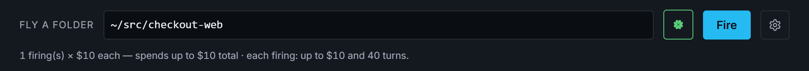
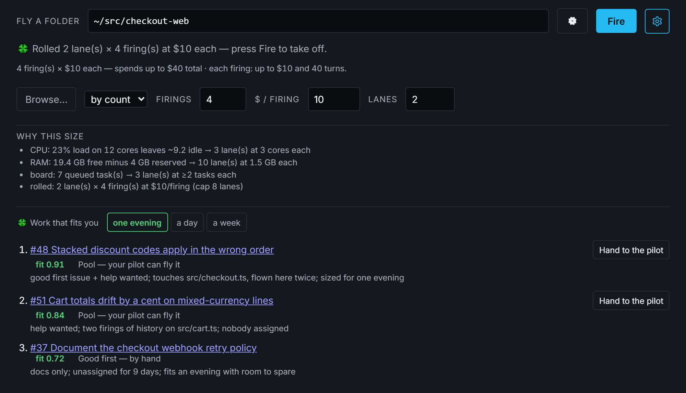
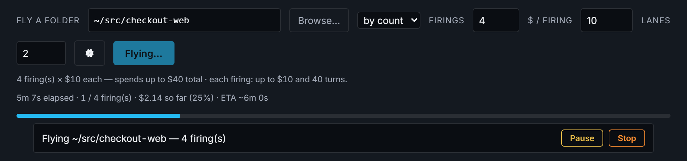
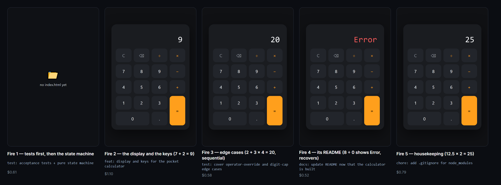
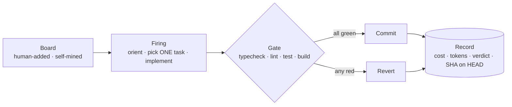
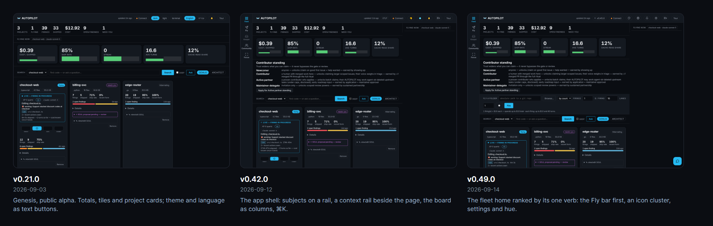

<p align="center">
  <picture>
    <source media="(prefers-color-scheme: dark)" srcset="docs/brand/goggles-mark-dark.svg">
    
  </picture>
</p>

# AUTOPILOT

<p align="center">
  <a href="https://github.com/M-A-S-T-E-R-M-I-N-D/AUTOPILOT/actions/workflows/ci.yml"></a>
  <a href="https://github.com/M-A-S-T-E-R-M-I-N-D/AUTOPILOT/releases"></a>
  <a href="LICENSE"></a>
  
  <a href="https://github.com/M-A-S-T-E-R-M-I-N-D/AUTOPILOT/discussions"></a>
</p>

**Point it at a folder. Press Fire.** AUTOPILOT orients itself in your repository, picks the
most valuable thing it can finish, does it, runs **your own** gate, commits when green, and
tells you what happened — again and again, inside the budget you set. There is no prompt to
write on the first launch: the mission is the code, the board and the docs already there.

It flies on your own Claude subscription through the local
[Claude Code](https://docs.anthropic.com/en/docs/claude-code) CLI — no API key, no per-token
bill. Nothing leaves the machine. Nothing lands unverified.

```bash
git clone https://github.com/M-A-S-T-E-R-M-I-N-D/AUTOPILOT.git && cd AUTOPILOT
./SETUP.sh        # Windows: double-click SETUP.cmd
pnpm dashboard:start        # → http://127.0.0.1:4317
```

Author / brand: **1337 · REL AZEUS · MΔSTERMIND** · Licence: **Apache-2.0** · No private data,
ever. Built on the shoulders of 487 open-source projects — [`THANKS.md`](THANKS.md) and
[`docs/THIRD-PARTY-LICENSES.md`](docs/THIRD-PARTY-LICENSES.md).

> [!WARNING]
> **Public alpha, before 1.0 — on purpose.** APIs, the store schema and the flight rituals may
> change between `0.x` releases without migration paths. An autonomous agent that edits repos is
> powerful: run it against code you have backups of. Every commit needs a DCO sign-off, pull
> requests merge only through the gated review ritual, and dependency- or security-sensitive
> changes always queue for a human — see [`SECURITY.md`](.github/SECURITY.md) and
> [`GOVERNANCE.md`](.github/GOVERNANCE.md). Provided **as is** (Apache-2.0 §7): whoever flies it
> does so at their own risk and judgment. 1.0.0 ships at the public-launch milestone
> ([`RELEASING.md`](docs/RELEASING.md)).

## Who this is for

| You are…                       | What you get                                                                                                    | Start here                                                                                                   |
| ------------------------------ | --------------------------------------------------------------------------------------------------------------- | ------------------------------------------------------------------------------------------------------------ |
| **a developer with a repo**    | an agent that ships small, gated, reversible changes while you do something else                                 | the three commands above, then [Lock on · Lucky · Fire](#lock-on--lucky--fire)                               |
| **a contributor**              | a codebase that states its laws, a board of claimable work, and a claim contract that protects your claim        | [`CONTRIBUTING.md`](.github/CONTRIBUTING.md) · [good first issues](https://github.com/M-A-S-T-E-R-M-I-N-D/AUTOPILOT/issues?q=is%3Aissue+is%3Aopen+label%3A%22good+first+issue%22) |
| **a researcher or data person** | per-firing telemetry — gate verdict, durations, tokens, cost, reverts — published as a living paper, failures included | [`docs/SELF-STUDY/PAPER.md`](docs/SELF-STUDY/PAPER.md) · [`docs/SELF-STUDY/DATA-SERIES.md`](docs/SELF-STUDY/DATA-SERIES.md) |
| **a company evaluating it**    | a local-first agent with a written verification contract, Apache-2.0, no data egress, no metered agent compute   | [`docs/THREAT-MODEL.md`](docs/THREAT-MODEL.md) · [`docs/ROADMAP.md`](docs/ROADMAP.md)                         |

Anyone with a GitHub account can help: open an issue, file a failure report, or tell the story
of a flight in [Discussions](https://github.com/M-A-S-T-E-R-M-I-N-D/AUTOPILOT/discussions).
Failure reports are first-class here — we publish our own.

## Lock on · Lucky · Fire

**1. Lock on.** Type or browse to a folder — any git repository. That is the whole setup: no
prompt, no config file, no YAML.



**2. Lucky (optional).** AUTOPILOT reads *this machine* (CPU, RAM, cores) and *this board*,
sizes a launch the computer can carry, and lists the work that fits the attention you have — an
evening, a day, a week. It only fills the form; the launch stays your click.



**3. Fire.** One firing is one gated attempt at one task: orient → do → gate → commit, or
revert. Watch the progress, pause or stop at any moment; every dollar and every verdict is
recorded, and the merge to `main` stays your click.



### What goes in, what comes out

**In:** a folder with a git repository. A board helps but is optional — on an empty board the
first firing proposes work and waits for your approval.

**Out:** a signed commit on `autopilot/flight` with its provenance, a METRICS line the engine
cross-checks against git, and a telemetry row. Never a push, never a merge.

```text
feat(checkout): apply stacked discount codes in a deterministic order

Sorts the code list before applying, so two orders of the same codes total
the same; adds the regression test that failed first.

Signed-off-by: Your Name <you@example.com>
Model: claude-sonnet-5
Firing-Prompt-Version: firing-v17
Assisted-by: AUTOPILOT v0.54.0 <https://github.com/M-A-S-T-E-R-M-I-N-D/AUTOPILOT>
Harness: claude-cli

METRICS:{"item":"task-1","outcome":"shipped","kind":"feat","sha":"7f3e9c1","completion":"complete","testFirst":true}
```

| firing | item   | gate                                     | cost  | turns | verdict            |
| ------ | ------ | ---------------------------------------- | ----- | ----- | ------------------ |
| 1      | task-1 | typecheck ✓ lint ✓ test ✓ build ✓ (54 s) | $2.14 | 22    | shipped · complete |

### Five firings, from a folder of notes to a calculator

A folder with notes, a key layout and one inbox line — no code — locked on and fired five
times, one firing per press, **$3.60** in all: tests first and the state machine, then the
display and keys, then edge-case tests, its README, and housekeeping. Seventeen acceptance
tests green, 109 lines of logic. The seed is
[`samples/calculator-materials/`](samples/calculator-materials/); the frames, the costs and what
went wrong are in [the case study](docs/CASE-STUDIES/calculator-five-firings.md).



## How it works, in 60 seconds

AUTOPILOT's unit of work is a **firing** — one gated attempt at one task:



**How to read this:** a task reaches the **board** either because you added it
or because AUTOPILOT mined it from the repository. One **firing** picks a
single task and implements it. Your project's own **gate** — typecheck, lint,
test, build — then decides: all green and the work is **committed**, anything
red and it is **reverted**. Both endings are written to the same local
**record**, with what the firing cost, how many tokens it spent, how the gate
ruled, and which commit is on HEAD.

- **Nothing lands unverified.** A firing that fails the gate reverts.
- **Fleets parallelise it.** N lanes fly in isolated git worktrees; a self-healing merge ladder
  collects them with zero overwrites.
- **The telemetry cannot flatter itself.** Gate result and commit-on-HEAD are mechanically
  verified, not self-reported — and published in [the living self-study](docs/SELF-STUDY/PAPER.md).
- **Humans keep the human calls.** Dependencies, publicity, spending — anything out of scope
  queues for your approval in the Keeper list.

Every law a firing flies by is written down in [`docs/MASTER-PROMPT.md`](docs/MASTER-PROMPT.md).

## How it differs

|                 | AUTOPILOT                                                                          | Cloud coding agents                | Claude Code alone    |
| --------------- | ---------------------------------------------------------------------------------- | ---------------------------------- | -------------------- |
| First launch    | no prompt — the repo is the mission                                                | a task prompt per run              | a prompt per session |
| Where it runs   | your machine, your subscription, no API key                                        | their cloud, their meter           | your machine         |
| Before a commit | your whole gate runs; red reverts, always                                          | tests when asked; a PR to review   | you review           |
| Git             | additive only — no force-push, no rewrite, never touches `main`; landing is a click | a PR against your branch           | whatever you run     |
| Parallel work   | fleets of worktree lanes with a self-healing merge ladder                          | one task per run                   | one session          |
| Telemetry       | every firing, cross-checked against git, published                                 | run logs                           | none                 |

## Can it hurt my repo?

The first question anyone should ask an agent that edits code.

1. **Backup before first touch** — locking on snapshots the repo (MYTH/LEGACY) before any flight
   ([ADR-0003](docs/adr/0003-myth-legacy-flight-branch-backup-ritual.md)).
2. **Everything is a git commit** — no force-pushes, no history rewrites, no remotes touched on
   its own. Undo is always `git revert <sha>`.
3. **Nothing lands unverified** — the gate runs before every commit; gate *durations* are
   recorded too, because we learned the hard way that "green" alone can lie
   ([the silent-gate evaluation](docs/EVALUATION-2026-08-27-silent-gate.md)).
4. **Landing is your click** — flights work on a flight branch; merging to `main` is explicit.
5. **Containment is seatbelts, not a cage — we say so plainly.** Flights run in isolated
   worktrees behind a guard that blocks and logs escape attempts, but a shell step is not a
   kernel sandbox. Full analysis: [`docs/THREAT-MODEL.md`](docs/THREAT-MODEL.md) ·
   [`docs/FLIGHT-CONTAINMENT.md`](docs/FLIGHT-CONTAINMENT.md).
6. **Nothing phones home** — telemetry is a local SQLite file. The one outbound path is the
   OpenTelemetry exporter, dormant unless *you* set `OTEL_EXPORTER_OTLP_ENDPOINT`.

## It builds itself — and you can audit the claim

Most of this repository's commits were shipped by AUTOPILOT's own fleets. The same screen, at
five points in its own history, each earlier frame taken from the README that shipped at that
version, and today's in the terminal theme with every effect on:



```bash
git log --format=%B | grep -c "Firing-Prompt-Version"   # commits carrying the fleet's trailer
pnpm self-study:update                                   # regenerate the paper from local telemetry
```

Every firing, gate verdict, ship, revert and dollar is recorded and published in
[the living self-study paper](docs/SELF-STUDY/PAPER.md) — including the failures
([case studies](docs/CASE-STUDIES/) · [dated evaluations](docs/)). Every number there carries the
software version, the model id and the date it was measured. No claims without a paper trail.

## Status

Current version **0.54.0** — see [`CHANGELOG.md`](CHANGELOG.md). Built milestone by milestone;
the honest, checked-against-the-code state of every milestone, the quarterly plan, the risks and
what is deliberately not started yet all live in **[`docs/ROADMAP.md`](docs/ROADMAP.md)**.

| Milestone                                               | State                                                           |
| ------------------------------------------------------- | --------------------------------------------------------------- |
| M0–M4 foundations · engine · onboarding · dashboard · reactivity | shipped (`v0.6.0` → `v0.33.0`)                            |
| M5 control & approvals                                   | mostly shipped — open: task edit, impact preview, a versions screen |
| M6–M9 efficiency · fleets & multi-project · harness & security · packaging | in progress, each with named gaps                |
| M10–M13 the pool · GitHub mode · the cockpit · published evidence | in progress; evidence largely shipped                     |
| M14–M16 providers & models · benchmarks & standing · adjacent modes | not started — the next frontier                        |

## What it is bad at today

- **It is a 0.x alpha**: APIs, schema and rituals change between releases.
- **Quota-bound, and Pro stalls fast**: a 96-attempt, 3-day sample burned ~524M cache-read
  tokens — ~5.5M/firing, in line with the per-firing average [RESEARCH-LIBRARY's cost
  anatomy](docs/RESEARCH-LIBRARY.md) already measured. A Pro seat's quota refills slower than
  that rate drains it; **Max is the realistic tier for a flight left running unattended**
  overnight or over a weekend.
- **Single-subject evidence**: the self-study measures AUTOPILOT flying *its own* repo; nothing
  here proves it performs the same on yours
  ([threats to validity](docs/SELF-STUDY/PAPER.md#6-threats-to-validity)).
- **No external benchmark score yet** — and we will not quote one we have not run. The plan for
  earning one is in [the roadmap](docs/ROADMAP.md).
- **Not a kernel sandbox** (see above) — run it on code you have backups of.

## Start here (2 minutes, from nothing to a live dashboard)

1. **Set up** — Windows: double-click `SETUP.cmd` · macOS/Linux: `./SETUP.sh` · already have
   Node ≥ 22.13: `npm install -g pnpm && pnpm run setup`. It prints a doctor report; anything
   not `[OK]` prints its own fix.
2. **Log in once** with `claude` (your Claude subscription — no API key; see
   [Connecting your Claude account](#connecting-your-claude-account)).
3. **Open the control panel:** `pnpm dashboard:start` → <http://127.0.0.1:4317> (localhost only).
4. **Fly your first mission** — the built-in calculator sample ships with 12 deliberately-red
   acceptance tests and a written mission
   ([`samples/calculator/MISSION.md`](samples/calculator/MISSION.md)). Lock the Fly bar onto
   `samples/calculator`, press **Fire**, and watch it go 0 → 12/12 green — the same arc
   documented, including what went wrong, in
   [`docs/CASE-STUDIES/calculator.md`](docs/CASE-STUDIES/calculator.md). Prefer to spend nothing
   yet? `scripts/launchers/FLY-DASHBOARD.cmd` runs a scripted **$0 demo flight**.

[`docs/README.md`](docs/README.md) is the full documentation index.

## The dashboard


Three themes (dark · light · terminal) with a whole-design hue control, full English/עברית
localisation with a real RTL layout, and one settings gear for text size, font, spacing and
motion. One project's cockpit — the live firing beside landing, console, this round and the next
release, then the board as columns, the Keeper, the plan editor, the docs reader and the data:


<details>
<summary>For developers — the toolbox</summary>

```bash
pnpm run verify         # the full gate: typecheck · lint · format · test (≥80% cov) · build · secret/PII/SPDX scans
pnpm run mutation       # optional, slow: 121 Stryker mutation-testing runs (nightly in CI as six shards)
pnpm dashboard:status   # running | stopped | stale (+ doctor checks)   · dashboard:stop to stop
pnpm dashboard:watch    # RING-0 supervisor: owns start/revive/replace — observe, don't babysit
```

Every dashboard command has a double-click twin for Windows (`WATCH-DASHBOARD.cmd`, …) and a
`./*.sh` twin for macOS/Linux. Demo seeds live in `scripts/launchers/`.

```text
packages/
  engine/        the gated autonomous loop (resilience · telemetry · firing · loop + adapters)
  onboarding/    folder-lock backup ritual · gate auto-detection · content-hash project index
  store/         SQLite schema + migrations (projects · events · metrics · tasks · versions · index)
  tokens/        design tokens + dark/light/terminal themes (OKLCH, WCAG-verified)
  mcp/           control-as-MCP (the dashboard's own verbs) + a retrieval descriptor
apps/
  dashboard/     the localhost control panel (server + shell + lifecycle control)
docs/            vision · plan · research · evidence   ->  see docs/README.md
INBOX/           drop a note here for the next firing to read   ->  see INBOX/README.md
scripts/ci/      the CI validators (secret-scan · SPDX · bundle-size · npx-smoke · doc links · …)
```

</details>

<details>
<summary>Connecting your Claude account</summary>

AUTOPILOT flies through your **local Claude Code CLI**, so it uses whatever that CLI is
authenticated with — your Claude subscription by default, no API key, no per-token bill.

- **Subscription (default)** — Pro / Max / Team / Enterprise. Run `claude` and complete `/login`.
- **Subscription, headless** — `claude setup-token`, then export `CLAUDE_CODE_OAUTH_TOKEN`.
- **API key** (pay-per-token) — export `ANTHROPIC_API_KEY`.

AUTOPILOT strips a stray `ANTHROPIC_API_KEY` from the spawned environment in subscription mode,
so a key left in your shell cannot silently bill your account. The dashboard's Connect popover
manages both the Claude and the GitHub connection.

</details>

<details>
<summary>Talking to a live flight, and telemetry</summary>

Drop a file into [`INBOX/`](INBOX/README.md) and the next firing reads it, fresh, as optional
context; it is triaged into a queued board task and archived.

Every firing is captured as an un-fakeable `FiringRecord` (git-cross-checked self-report — model,
tokens, cost, gate result, tests delta) in SQLite.
[`packages/engine/src/otlp.ts`](packages/engine/src/otlp.ts) reshapes that record into an
[OTLP/HTTP JSON](https://opentelemetry.io/docs/specs/otlp/) trace — `gen_ai.*` and `autopilot.*`
attributes — exported only once you set an endpoint:

```bash
export OTEL_EXPORTER_OTLP_ENDPOINT="http://localhost:4318"
export OTEL_EXPORTER_OTLP_HEADERS="api-key=..."               # optional
```

Export is best-effort: a collector outage logs a warning and never fails a flight.

</details>

## Contributing & standards

Every change is gated (typecheck · lint · test ≥80% · build) and follows
[Conventional Commits](https://www.conventionalcommits.org) with DCO sign-off; Apache-2.0 with
per-file SPDX. Start with [`CONTRIBUTING.md`](.github/CONTRIBUTING.md), then
[`CODE_OF_CONDUCT.md`](.github/CODE_OF_CONDUCT.md), [`SECURITY.md`](.github/SECURITY.md),
[`GOVERNANCE.md`](.github/GOVERNANCE.md) and [`RELEASING.md`](docs/RELEASING.md). The engineering
laws live in [`docs/PATTERNS-AND-STANDARDS.md`](docs/PATTERNS-AND-STANDARDS.md) and
[`docs/ENGINEERING-DOCTRINE.md`](docs/ENGINEERING-DOCTRINE.md).

## How to cite

Using AUTOPILOT in research or a derivative project? [`CITATION.cff`](CITATION.cff) powers
GitHub's "Cite this repository" button; the same metadata as plain text:

<!-- HOW-TO-CITE:START -->
_Generated by `pnpm citation:update` from `package.json` + `CHANGELOG.md` — the same values [`CITATION.cff`](CITATION.cff) uses for GitHub's native "Cite this repository" button, so neither drifts from the other._

**BibTeX**

```bibtex
@software{autopilot_2026,
  author  = {1337 · REL AZEUS · MΔSTERMIND},
  title   = {{AUTOPILOT}},
  url     = {https://github.com/M-A-S-T-E-R-M-I-N-D/AUTOPILOT},
  version = {0.54.0},
  year    = {2026}
}
```

**APA**

1337 · REL AZEUS · MΔSTERMIND. (2026). *AUTOPILOT* (Version 0.54.0) [Computer software]. https://github.com/M-A-S-T-E-R-M-I-N-D/AUTOPILOT

**IEEE**

1337 · REL AZEUS · MΔSTERMIND, "AUTOPILOT," Version 0.54.0, 2026. [Online]. Available: https://github.com/M-A-S-T-E-R-M-I-N-D/AUTOPILOT
<!-- HOW-TO-CITE:END -->

## If it flew for you

Star the repository — at zero marketing, stars are how GitHub decides who else discovers this.
Found a bug, or watched a flight do something interesting?
[Open an issue](https://github.com/M-A-S-T-E-R-M-I-N-D/AUTOPILOT/issues) or
[tell the story in Discussions](https://github.com/M-A-S-T-E-R-M-I-N-D/AUTOPILOT/discussions).

Want to credit it in your own project? [`docs/BADGE.md`](docs/BADGE.md) has a snippet to paste —
offered, never forced; nothing here ever edits a README on your behalf.
