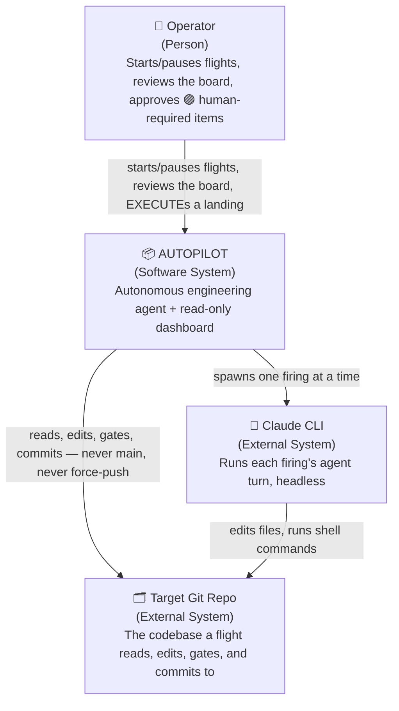
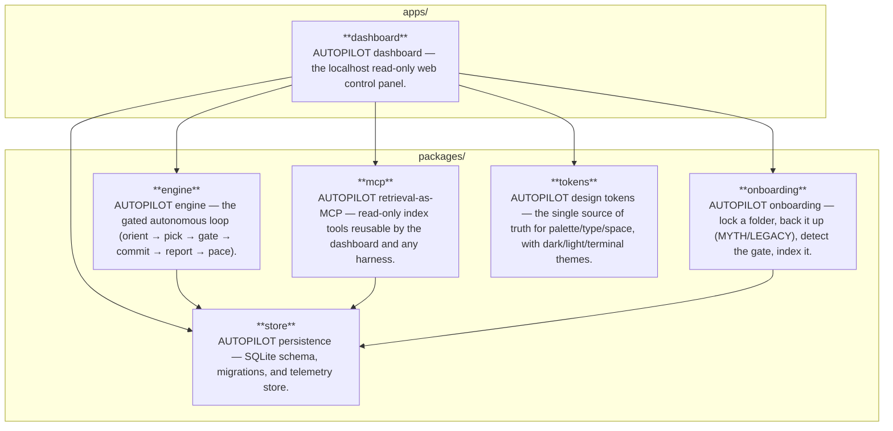

<!--
SPDX-FileCopyrightText: 2026 1337 · REL AZEUS · MΔSTERMIND
SPDX-License-Identifier: Apache-2.0
-->

# ARCHITECTURE

C4-style diagrams (Context, then Container), Mermaid-as-code so they're plain text: git-diffable,
reviewable in a PR, and — for the Container level — LLM/script-generatable straight from the real
workspace graph instead of hand-drawn and left to rot. Component-level diagrams are intentionally
omitted: a single package's internals are better read from its own `src/` than mirrored into a
second, driftable artifact. For the narrative version of these decisions, see
[MASTER-PLAN.md](MASTER-PLAN.md); for *why*, see [adr/README.md](adr/README.md).

## System Context

Hand-authored — the actors here are external to the codebase (a person, two other systems AUTOPILOT
talks to), so there's no source-of-truth file to generate this from the way the container diagram
below is generated from the package graph.

## Containers

Generated from every `packages/*/package.json` / `apps/*/package.json` — name, description, and
`@autopilot/*` dependencies. Refresh with `pnpm architecture:update`; `pnpm run ci:architecture`
(wired into `pnpm verify` and CI) fails the build if this block drifts from the real graph.

<!-- CONTAINER:DIAGRAM:START -->
_Generated 2026-08-27T15:14:47.898Z by `pnpm architecture:update` from every `packages/*/package.json` / `apps/*/package.json` — name, description, and `@autopilot/*` dependencies — not a hand-drawn diagram that can drift from what actually depends on what._

| Package | Path | Responsibility |
|---|---|---|
| `@autopilot/dashboard` | `apps/dashboard` | AUTOPILOT dashboard — the localhost read-only web control panel. |
| `@autopilot/engine` | `packages/engine` | AUTOPILOT engine — the gated autonomous loop (orient → pick → gate → commit → report → pace). |
| `@autopilot/mcp` | `packages/mcp` | AUTOPILOT retrieval-as-MCP — read-only index tools reusable by the dashboard and any harness. |
| `@autopilot/onboarding` | `packages/onboarding` | AUTOPILOT onboarding — lock a folder, back it up (MYTH/LEGACY), detect the gate, index it. |
| `@autopilot/store` | `packages/store` | AUTOPILOT persistence — SQLite schema, migrations, and telemetry store. |
| `@autopilot/tokens` | `packages/tokens` | AUTOPILOT design tokens — the single source of truth for palette/type/space, with dark/light/terminal themes. |
<!-- CONTAINER:DIAGRAM:END -->
