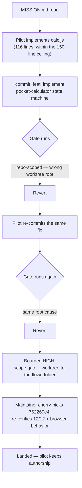
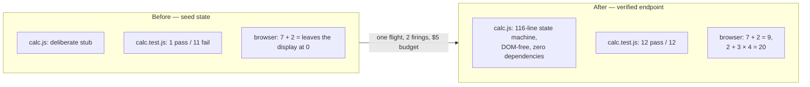

<!--
SPDX-FileCopyrightText: 2026 1337 · REL AZEUS · MΔSTERMIND
SPDX-License-Identifier: Apache-2.0
-->

# Case study — the calculator mission (2026-09-04)

The smallest possible full autonomous arc, run for real on launch night:
a one-page human brief, a machine-checkable endpoint, and a visible artifact
anyone can judge in ten seconds. This document reports exactly what happened,
including the part that went wrong — that is the house style.

## The setup (the human's five minutes)

- [`samples/calculator/MISSION.md`](../../samples/calculator/MISSION.md) — the whole brief: a classic pocket
  calculator, sequential evaluation (`2 + 3 × 4 = 20`, stated up front), keyboard support, divide-by-zero recovery,
  zero dependencies, ≤150 lines of logic, DOM-free state machine.
- **The endpoint was written as 12 failing tests** (`calc.test.js`) before any implementation existed — seed state
  verified: `1 pass / 11 fail`, and in a real browser `7 + 2 =` left the display at `0`.
- `calc.js` was a deliberate stub; `index.html`/`style.css` a designed shell wired and waiting.

## The flight (the machine's ~20 minutes)

One operator click: fly `samples/calculator`, 2 firings, $5 budget.

The pilot read the mission, implemented a 116-line state machine (within the
150-line ceiling), and committed:

> `feat: implement pocket-calculator state machine for calc.js`

**Verified afterward on its own merits: 12/12 acceptance tests green**, and in
a real browser `7 + 2 = 9` and `2 + 3 × 4 = 20` — the exact pocket semantics
the mission demanded. The autonomous 0→100% happened.

## What went wrong (and is now a boarded fix)

The flight's own gate **reverted the correct work — twice** (`feat` →
`Revert`, `feat` → `Revert`). Root cause: the flown folder is a SUBFOLDER of
the AUTOPILOT monorepo, so the flight's worktree was of the parent repo and
the gate ran repo-scoped instead of against the sample's own `npm test` —
which the implementation passed all along. The delivery leg, not the
engineering, failed. Boarded HIGH the same night: scope the gate + worktree
to the flown folder or its nearest project root.

The maintainer then landed the pilot's own commit — a cherry-pick, so the
flight keeps its authorship (`762269e4`) — after re-verifying the 12/12 and
the browser behavior independently.

## The scorecard, against MISSION.md's own checklist

| Endpoint item | Result |
| --- | --- |
| All 12 acceptance tests green | ✅ 12/12 |
| Works by mouse and keyboard | ✅ (clicked live; key handling covered by the press-machine tests) |
| Divide-by-zero → `Error`, clean recovery | ✅ (tested) |
| Zero dependencies, no build step | ✅ |
| Logic ≤150 lines, DOM-free | ✅ 116 lines, pure |
| Seed design kept | ✅ untouched |

**Mission completion: 100% of the defined endpoint — engineered autonomously;
delivered with one human assist that exists only because of a now-boarded
harness bug.** That sentence is the honest version, and it is the only
version this repo publishes.

No cost/firing/ship-rate chart accompanies this diagram: this mission predates
per-firing telemetry granular enough to chart honestly (`docs/SELF-STUDY/DATASHEET.md`) —
"2 firings, $5 budget" above is the whole paper trail that survives. A chart
built from anything finer would be inventing numbers, which is exactly what
this directory's [standard](README.md#standard) exists to refuse.

## Follow-up flight — the percent key (2026-09-04/05)

A second, smaller unit flown against the same sample, worth recording for the
same reason the first one is: the failure is as instructive as the feature.

**What was asked:** GitHub issue #8 — a classic pocket calculator treats `%`
as divide-current-entry-by-100 (`50 % → 0.5`); the seed calculator shipped
without it.

**The flight (RED → GREEN, ~4 minutes):** one commit, TDD in order —

> `feat(calculator): add a percent key — divide-by-100, wired end to end`
>
> A classic pocket calculator treats % as divide-current-entry-by-100. Added
> a failing acceptance test first (50 % → 0.5; RED at 12/13), then
> `pressPercent` in `calc.js` (unary, sets overwrite so a following digit
> starts fresh, consistent with `pressOperator`/`pressEquals`), the `%`
> button in `index.html` … and the keydown allowlist. 13/13 green.
>
> Closes #8.

`f062e62d`, 2026-09-04 23:07 — verified on its own merits: 13/13 tests green,
the `%` key present in the DOM (`index.html:31`) and wired in `calc.js`'s
`pressPercent` (`calc.js:96`).

**What went wrong:** four minutes later (`c13e4a80`, 23:11) the commit was
reverted — not for a defect in the percent key itself, but as one of six
unrelated commits swept up together in the same two-minute window (a
self-study data refresh, a primary-checkout concurrency doc, the repo-wide
"great hygiene sweep" doc pass). All six were reverted as a batch, then all
six reapplied as a batch nine hours later (`8cc9c6c6`, 2026-09-05 08:18) once
the tree settled, the percent key landing back intact and unchanged. This is
the same failure class the maintainer later formalized in
[`docs/debriefs/2026-09-06-red-main-revert-cascade.md`](../debriefs/2026-09-06-red-main-revert-cascade.md):
a stale red verdict, reacted to with a revert that discards every commit
sitting near the bad SHA regardless of relevance, not just the one that
caused it. No content was lost here — the batch reapply was exact — but the
9-hour gap between "shipped" and "actually landed" is the honest cost of the
pattern, paid twice on this one mini-app before it got a name.

**Scorecard delta:**

| Endpoint item | Result |
| --- | --- |
| `%` key: divide current entry by 100 | ✅ 13/13 (was 12/12 before this flight) |

## Try it yourself

Open [`samples/calculator/index.html`](../../samples/calculator/index.html)
in any browser. Then read the mission, delete `calc.js`'s body back to the
stub, and fly it again on your own account — the endpoint is yours to verify.
